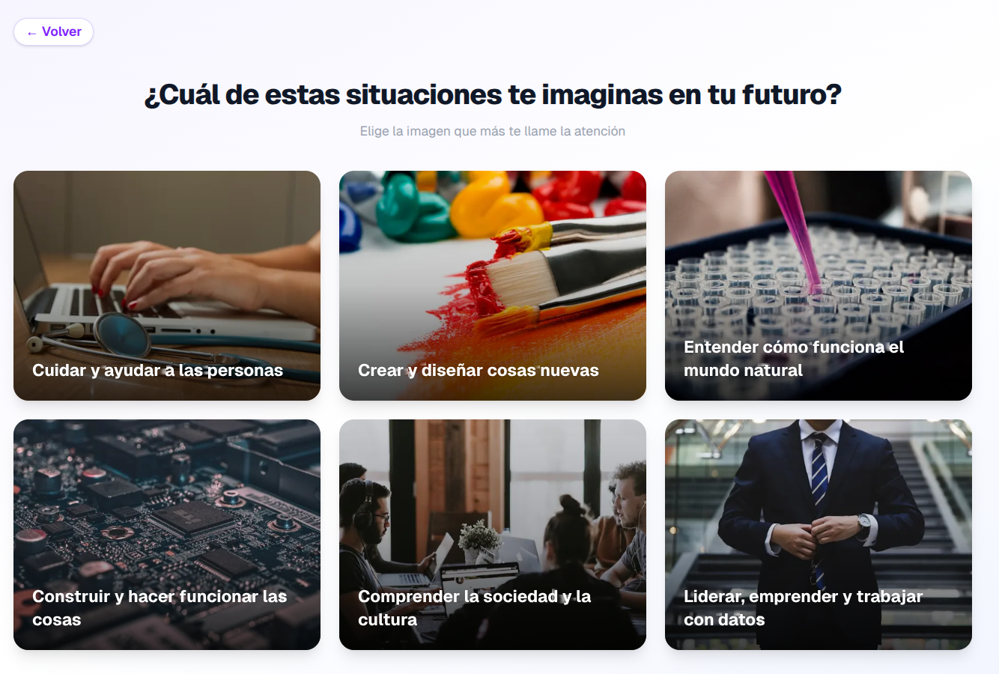

# ¿Qué quieres ser de mayor?

Una herramienta interactiva para estudiantes de **4º de ESO** que quieren explorar qué carrera universitaria encaja mejor con su forma de ver el mundo — antes de elegir su modalidad de Bachillerato.



## Para quién es esta herramienta

Pensada para **estudiantes de 4º de ESO** y sus familias, tutores y equipos de orientación que quieren:

- Conectar intereses personales con salidas académicas reales
- Entender qué modalidad de Bachillerato prepara para cada área
- Explorar carreras de forma visual e intuitiva, sin presión ni conocimiento previo

## Cómo funciona

El alumno avanza por un árbol de decisión eligiendo imágenes que representan escenarios de futuro. En 2-3 pasos, las opciones se van concretando hasta llegar a un grupo de **carreras universitarias recomendadas** junto con la **modalidad de Bachillerato** que mejor las prepara.

En cualquier momento se puede volver atrás y explorar otro camino.

## Qué carreras cubre

La herramienta incluye **78 carreras universitarias** del sistema español, agrupadas en 6 grandes áreas vocacionales:

| Área | Ejemplos de carreras |
|---|---|
| Cuidar y ayudar | Medicina, Odontología, Enfermería, Psicología, CAFYD, Magisterio |
| Crear y diseñar | Bellas Artes, Diseño UX/UI, Animación 3D, Comunicación Audiovisual |
| Mundo natural | Biología, Biotecnología, Física, Ciencias del Mar, Química |
| Construir y hacer | Ingeniería Informática, Robótica, Arquitectura, Aeroespacial, IA |
| Sociedad y cultura | Derecho, Criminología, Historia, Filología, Relaciones Internacionales |
| Liderar y emprender | ADE, Economía, Finanzas, Turismo, Dirección Hotelera |

Las carreras se relacionan con las cuatro modalidades de Bachillerato vigentes en España:

| Modalidad | Perfil |
|---|---|
| **Ciencias** | Salud, ciencias puras y deporte |
| **Tecnológico** | Ingenierías, informática y arquitectura |
| **Humanidades y Ciencias Sociales** | Derecho, economía, comunicación, turismo |
| **Artes** | Diseño, bellas artes, música y teatro |

## Diseño del árbol de decisiones

El árbol tiene **3 niveles** de preguntas. En cada nivel la pregunta se vuelve más específica:

1. **Raíz** — ¿En qué ámbito vital te imaginas tu futuro? (6 opciones)
2. **Nivel 2** — ¿Qué aspecto de ese ámbito te atrae más? (2-3 opciones)
3. **Nivel 3** — ¿Qué tipo concreto de actividad te imaginas haciendo? (2-3 opciones)

Cada camino termina mostrando entre 3 y 6 carreras relacionadas, con una descripción de la profesión y ejemplos concretos del día a día.

Las preguntas están formuladas en torno a **motivaciones** (¿qué me imagino haciendo?) en lugar de habilidades (¿en qué soy bueno/a?). Los estudiantes de 4º de ESO aún tienen tiempo de desarrollar las competencias que cada carrera requiere; lo que importa en este momento es identificar qué les mueve.

---

## Tech stack

| | |
|---|---|
| Framework | Next.js 15 (App Router) |
| UI | React 19 + Tailwind CSS v4 |
| Lenguaje | TypeScript 5 |
| Tests | Jest 30 + React Testing Library |

## Desarrollo local

```bash
npm install
npm run dev
```

La app arranca en [http://localhost:3040](http://localhost:3040).

## Scripts disponibles

| Script | Descripción |
|---|---|
| `npm run dev` | Servidor de desarrollo |
| `npm run build` | Build de producción |
| `npm run start` | Inicia el build de producción |
| `npm run test` | Ejecuta los tests |
| `npm run lint` | Comprueba el código con ESLint |
